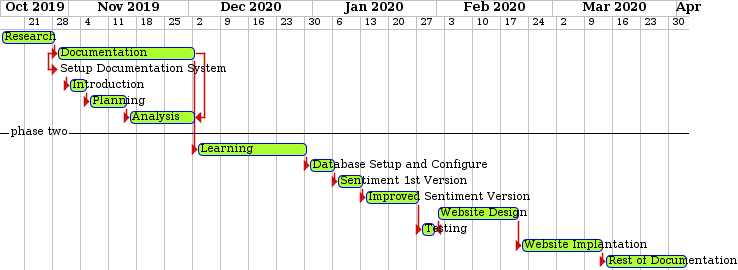

Project Planning and Analysis
==============================

In this chapter we’re going to discuss and go deeper in how we plan the
project and show the steps and the instructions that we’ve followed to
plan the application.

Project Planning:- 
-------------------

Feasibility Study
~~~~~~~~~~~~~~~~~

A Feasibility study is used to determine if a business or a specific project is achievable, so for determining the achievability of our project we’ll go deeper in the following points:-

Estimated Cost
~~~~~~~~~~~~~~

A "cost estimate" is approximation of the cost of a program, project or operation. the cost estimate is the product of the cost estimating process so we'll discuss our estimated cost for this project as following:-

**In our project we had a financial issue like:**

1. Meeting three times a month in a public workspace : (180 LE) (from august to February 180*15 including vacations and holidays = 3240 LE).

2. Some resources and programs we used to make our analysis (hnktb as3ar el tools elly elmfrod esht8lna 3leha "Purchasing tools").

Gantt Chart
~~~~~~~~~~~

User Requirements:-
--------------------

**- Mandatory requirements:**

- user want to be in a social media analysis community, that analyze to him the statistics that help him in improving his working plans.

- Media Agency Want To Monitor Multiple Brand and Topics

**- Desirable requirements:**

- Easy To Use Interface

- Weekly Report

System Requirement
~~~~~~~~~~~~~~~~~~

- Flask (Web development).

- Mongo DB
  open source NoSQL Database. 

- Internet connection:
  This app uses a cloud server to store data, so you need to be connected to the internet to fetch and view it.

- Python (with Common package like Pandas, Numpy)

- Scikit-Learn

- D3 (for Visual Presentation in Website)

Domain Requirement
~~~~~~~~~~~~~~~~~~
1. Multiple users must be able to use the application simultaneously without corrupting the database.

2. The application must have update capabilities for future models and accessories.

3. The necessary software required to run the application.

4. Reports are required.

5. The database should be backed up every once in a while in case the original does become corrupt*********(dh fe 7alet e7na sh8leen DB or stream).

.
.
.

Functional Requirement
~~~~~~~~~~~~~~~~~~~~~~

1. Account Management

2. Sentiment Analysis for Social Media Content

3. Aspect Sentiment Analysis

4. Easy To Use User Interface (Web or Mobile)

Non-Functional Requirement
~~~~~~~~~~~~~~~~~~~~~~~~~~

**1. Availability:**

Our application can be used in any time and it always “uptime” is the amount of time that it is operational and available for use. This is specified because some systems are designed with expected downtime for activities like database upgrades and backups.

**2. Efficiency:**

Our application utilizes scarce resources: CPU cycles, disk space, memory, bandwidth, etc.

**3. Flexibility:**

If the team intends to increase or extend the functionality of the software after it is deployed, that should be planned from the beginning; it influences choices made during the design, development, testing, and deployment of the system.
Performance:
Our application is specify the timing characteristics of the software. Certain tasks or features are more time sensitive than others; the nonfunctional requirements should identify those software functions that have constraints on their performance.

**4. Reliability:**

Our application is capable of the software to maintain its performance over time. 
Unreliable software fails frequently, and certain tasks are more sensitive to failure.

**5. Robustness:**

Our application is able to handle error conditions gracefully, without failure. This includes a tolerance of invalid data, software defects, and unexpected operating conditions.

**6. Scalability:**

Our application is scalable has the ability to handle a wide variety of system configuration sizes. The nonfunctional requirements should specify the ways in which the system may be expected to scale up (by increasing hardware capacity, adding machines, etc.).

**7. Usability:**

Our application is Ease to use requirements address the factors that constitute the capacity of the software to be understood, learned, and used by its intended users.

Advantage of the new system
---------------------------

- Get Insights More Detailed Insights from User Feedback

Risk and Risk Managements
-------------------------

Risk management is the process of identifying, assessing, reducing and accepting risk. Efforts to avoid, mitigate and transfer risk can produce significant returns. Risk management also leads to a culture of explicitly accepting risk as opposed to hiding in the optimism that challenges and failures aren't possible.

**The following are hypothetical expected examples of risk management:**

- **Poor password selection:**

 Every new user should register on our system by username, password, etc... Poor password may cause a high risk, so this risk management is: Use a combination of upper-case and lower-case, numbers and special characters such as: @ \# \% ( ) , : “ „ etc.. Make your password long enough: Between 8 to 20 characters is recommended. Omit duplicates “Use a unique password for each of your accounts. The same password should never be used more than once!”

- **Unregistered system events**

  In our system events are the data comes from sensors by date and time and saved in database, because of any failure it may be a high risk to un-register that events from our system.

- **Hardware Failure**

 We have different types of hardware such as devices, servers, electrical cables, etc.... So, we can manage it by make alerts if any hardware fail.

.. toctree::
   :maxdepth: 3
   :caption: Index
